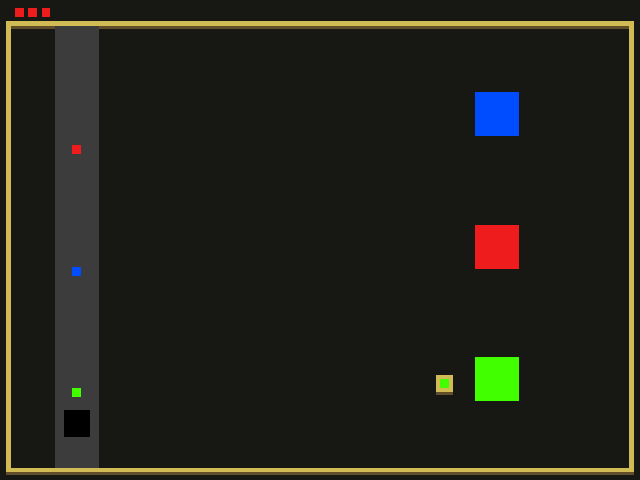

# Robot Conveyor

Author: Haidar Jamal

Design: You are a warehouse robot. You have to pick up different items from a conveyor belt to keep your job.

Screen Shot:

How To Play:
Arrow keys to move the robot around. Space bar to pick up a box from the belt. Space bar to drop the box into a bucket.
If the box isn't picked up, the box will fall into a hole at the end of the conveyor belt. 
Red boxes add or remove health. 
Green boxes add or remove points. 
Blue boxes are boosts if dropped into a bucket, else they speed up the conveyor belt.
You need to score 5 points to win!

This game was built with [NEST](NEST.md).
